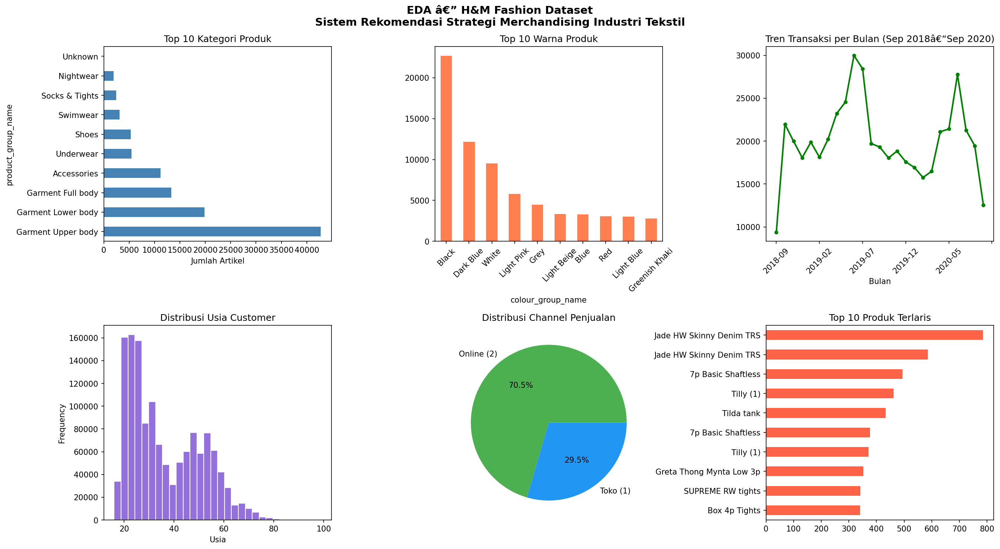
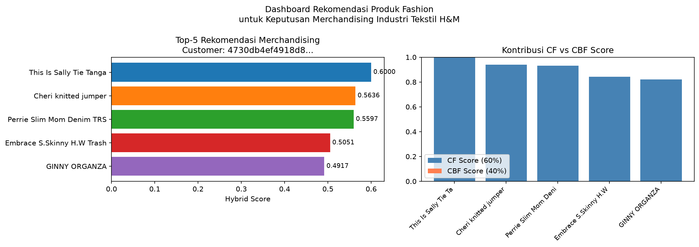

---

title: FashionRec Backend
emoji: 👗
colorFrom: purple
colorTo: pink
sdk: docker
app_port: 7860
--------------

# 👗 Fashion Recommendation System

> Sistem rekomendasi fashion berbasis Machine Learning menggunakan Collaborative Filtering, Content-Based Filtering, dan Hybrid Recommendation.


[](https://fashion-recommendation-system-phi.vercel.app)
[](https://lindanggara-fashionrec-backend.hf.space)
[](https://github.com/lindanggara/fashion-recommendation-system)

---

## 📌 Overview

Fashion Recommendation System merupakan aplikasi berbasis Machine Learning yang dirancang untuk membantu pelanggan menemukan produk fashion yang relevan berdasarkan histori transaksi dan karakteristik produk.

Sistem menggabungkan beberapa pendekatan rekomendasi:

* Collaborative Filtering (SVD)
* Content-Based Filtering (TF-IDF)
* Hybrid Recommendation

Selain menghasilkan rekomendasi produk yang dipersonalisasi, aplikasi juga menyediakan dashboard analitik interaktif untuk memantau performa produk, tren transaksi, dan perilaku pelanggan.

---

## ✨ Features

### 🤖 Recommendation Engine

* Personalized Product Recommendation
* Collaborative Filtering (SVD)
* Content-Based Filtering (TF-IDF)
* Hybrid Recommendation
* Top-N Recommendation

### 📊 Analytics Dashboard

* KPI Summary
* Monthly Trends
* Top Selling Products
* Category Distribution
* Colour Analysis
* Export CSV

### 👥 Customer Features

* Purchase History
* Customer Profile
* Favorite Category Analysis
* Category Filter
* Reorder Feature

### 🎨 User Experience

* Responsive Design
* Dark / Light Mode
* Interactive Charts
* Loading Skeleton
* Toast Notification
* Keyboard Shortcuts

---

## ⌨️ Keyboard Shortcuts

| Shortcut | Function     |
| -------- | ------------ |
| Ctrl + K | Focus Search |
| Esc      | Close Modal  |
| Ctrl + R | Refresh Data |

---

## 🛠️ Technology Stack

### Frontend

| Technology   | Purpose            |
| ------------ | ------------------ |
| React        | User Interface     |
| TypeScript   | Type Safety        |
| Vite         | Build Tool         |
| Recharts     | Data Visualization |
| Axios        | API Communication  |
| Lucide React | Icons              |

### Backend

| Technology   | Purpose                  |
| ------------ | ------------------------ |
| FastAPI      | REST API                 |
| Python 3.11  | Programming Language     |
| Pandas       | Data Processing          |
| NumPy        | Numerical Computing      |
| Scikit-Learn | Machine Learning         |
| Surprise     | SVD Recommendation Model |
| Uvicorn      | ASGI Server              |

### Machine Learning

| Method                | Description                    |
| --------------------- | ------------------------------ |
| SVD                   | Collaborative Filtering        |
| TF-IDF                | Product Feature Representation |
| Cosine Similarity     | Product Similarity             |
| Hybrid Recommendation | Combination of CF and CBF      |

---

## 🚀 Installation

### Prerequisites

* Python 3.11+
* Node.js 18+
* npm atau yarn

### Clone Repository

```bash
git clone https://github.com/lindanggara/fashion-recommendation-system.git
cd fashion-recommendation-system
```

### Backend Setup

```bash
cd backend

python -m venv venv

venv\Scripts\activate

pip install -r requirements.txt

uvicorn app.main:app --reload --port 8000
```

### Frontend Setup

```bash
cd frontend

npm install

npm run dev
```

---

## 🌐 Application Access

| Service           | URL                                                  |
| ----------------- | ---------------------------------------------------- |
| Frontend          | https://fashion-recommendation-system-phi.vercel.app |
| Backend API       | https://lindanggara-fashionrec-backend.hf.space      |
| API Documentation | https://lindanggara-fashionrec-backend.hf.space/docs |

---

## 📂 Project Structure

```text
fashion-recommendation-system/
│
├── backend/
│   ├── app/
│   │   ├── main.py
│   │   └── __init__.py
│   ├── models/
│   ├── requirements.txt
│   └── Dockerfile
│
├── frontend/
│   ├── src/
│   │   ├── pages/
│   │   ├── components/
│   │   ├── hooks/
│   │   └── config/
│   ├── public/
│   └── package.json
│
├── docs/
├── notebooks/
├── models/
└── README.md
```

---

## 📡 API Endpoints

### Analytics

| Method | Endpoint                        |
| ------ | ------------------------------- |
| GET    | /analytics/overview             |
| GET    | /analytics/monthly-transactions |
| GET    | /analytics/top-products         |
| GET    | /analytics/top-categories       |
| GET    | /analytics/top-colours          |
| GET    | /analytics/model-metrics        |

### Customer

| Method | Endpoint               |
| ------ | ---------------------- |
| GET    | /customer/{id}/info    |
| GET    | /customer/{id}/history |
| GET    | /customers/top         |

### Recommendation

| Method | Endpoint   |
| ------ | ---------- |
| POST   | /recommend |

### Feedback

| Method | Endpoint        |
| ------ | --------------- |
| POST   | /feedback       |
| GET    | /feedback/stats |

---

## 📈 Model Performance

| Model                         | RMSE        | MAE         |
| ----------------------------- | ----------- | ----------- |
| Collaborative Filtering (SVD) | 0.0794      | 0.0265      |
| Content-Based Filtering       | Active      | Active      |
| Hybrid Recommendation         | Best Result | Best Result |

### Dataset Summary

* Dataset: H&M Personalized Fashion Recommendations
* Transactions: 500.000 sample records
* Customers: 1,3 juta pelanggan
* Products: 105 ribu artikel fashion

---

## 📸 Screenshots

### Dashboard Analytics



### Recommendation Results



---

## 🎯 SDGs Contribution

### SDG 9 – Industry, Innovation and Infrastructure

Project ini mendukung transformasi digital pada industri fashion melalui:

* Pemanfaatan Machine Learning untuk sistem rekomendasi.
* Peningkatan pengalaman pelanggan melalui personalisasi produk.
* Pengembangan solusi berbasis data untuk industri retail.

---

## 👨‍💻 Author

**Linda Anggara Wati**

| Detail        | Information                                               |
| ------------- | --------------------------------------------------------- |
| NRP           | 3324600008                                                |
| Program Studi | Sains Data Terapan (D4)                                   |
| Institusi     | Politeknik Elektronika Negeri Surabaya (PENS)             |
| Email         | [lindaanggaraw@gmail.com](mailto:lindaanggaraw@gmail.com) |
| GitHub        | https://github.com/lindanggara                            |

Repository:
https://github.com/lindanggara/fashion-recommendation-system

---

## 📄 License

MIT License

Copyright © 2026 Linda Anggara Wati

---

## 🙏 Acknowledgments

* H&M Group Dataset
* FastAPI Community
* React Community
* Scikit-Learn
* Scikit-Surprise
* Politeknik Elektronika Negeri Surabaya (PENS)

---

<div align="center">

⭐ If you find this project useful, consider giving it a star!

Made with ❤️ using FastAPI, React, and Machine Learning

</div>
